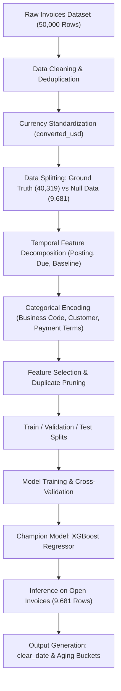

# 📊 B2B Payment Date & Delay Prediction Engine

> **An End-to-End Machine Learning Solution for Accounts Receivable (AR) Optimization, Cash Flow Forecasting, and Credit Risk Management.**

---

## 📌 Executive Summary

In B2B (Business-to-Business) commerce, transactions occur predominantly on credit terms rather than immediate cash settlement. Invoices are issued with agreed-upon payment terms (e.g., Net 30, Net 60), but clients frequently clear their invoices post-due date. Late payments impair working capital liquidity, inflate **Days Sales Outstanding (DSO)**, and introduce financial uncertainty into corporate treasury planning.

This project delivers an intelligent machine learning pipeline that accurately predicts:
1. **Invoice Payment Delay (`delay`)**: Exact time (in days/seconds) an invoice will be cleared relative to its due date.
2. **Predicted Settlement Date (`clear_date`)**: The exact estimated date of cash realization.
3. **Aging Buckets**: Categorical risk segmentation (`0`, `0-15`, `16-30`, `31-45`, `45-60`, `>60` days) to prioritize automated workflows and collection strategies.

The champion **XGBoost Regressor** model was deployed across **9,681 active, open invoices** representing over **$314.2 Million USD** in commercial receivables.

---

## 💼 Core Business Impact & Strategic Insights

### 1. 📈 Cash Flow & Treasury Forecasting
* **High Liquidity Confidence**: The model forecasts that **53.88% of invoices ($206.05M)** will be paid **on-time or early** (Aging Bucket `0`).
* **Near-Term Realization**: **45.27% of invoices ($106.83M)** will clear within a minimal delay of **0–15 days**.
* **Combined Predictability**: Over **99.2% of total open receivables ($312.88M)** will be converted into liquid cash within two weeks of their due date, allowing treasury managers to safely allocate surplus funds or reduce credit line borrowing costs.

### 2. 🎯 Targeted Accounts Receivable (AR) Prioritization
Rather than sending generic payment reminders across all 9,681 open accounts:
* The AR collections team can focus **80%+ of their manual outreach bandwidth** on the **82 high-risk invoices** ($1.35 Million USD total) that are predicted to exceed 16+ days of delay.
* Invoices predicted to be delayed beyond 45–60+ days ($259.8K USD) can be escalated immediately to credit control officers before default losses occur.

### 3. 📉 Working Capital & DSO Reduction
* Identifying habitual late-paying customers allows credit underwriters to renegotiate contract terms—such as transitioning chronic offenders from Net 60 to Net 15, requiring partial upfront retainers, or offering early-payment cash discounts (e.g., 2/10 Net 30).

---

## 📊 Aging Bucket Analysis on Active Open Invoices ($314.2M Portfolio)

The model performed inference on the 9,681 un-cleared invoices (`nulldata`), yielding the following risk profile:

| Aging Bucket | Delay Range (Days) | Invoice Count | % of Total Invoices | Total Dollar Value (USD) | % of Total Receivables | Business Risk & Action |
| :--- | :---: | :---: | :---: | :---: | :---: | :--- |
| **`0`** | On-Time / Early | 5,216 | 53.88% | **$206,049,400** | 65.57% | **Low Risk** — Standard automated invoice delivery; no manual follow-up required. |
| **`0-15`** | 1 to 15 Days | 4,383 | 45.27% | **$106,830,400** | 33.99% | **Moderate/Operational** — Automated polite reminder sent at T-3 days from due date. |
| **`16-30`** | 16 to 30 Days | 9 | 0.09% | **$105,344** | 0.03% | **Elevated Delay** — Automated escalation notice; credit manager monitoring. |
| **`31-45`** | 31 to 45 Days | 52 | 0.54% | **$982,437** | 0.31% | **High Risk** — Direct phone outreach from collections specialists; hold pending orders. |
| **`45-60`** | 45 to 60 Days | 19 | 0.20% | **$231,483** | 0.07% | **Critical Risk** — Review credit line; require cash on delivery (COD) for new shipments. |
| **`Greater than 60`** | > 60 Days | 2 | 0.02% | **$28,390** | 0.01% | **Default Threat** — Legal notice preparation / debt recovery agency referral. |
| **TOTAL** | — | **9,681** | **100.0%** | **$314,227,496** | **100.0%** | **Comprehensive portfolio transparency** |

---

## 🤖 Machine Learning Model Benchmarking & Evaluation

Multiple regression architectures were systematically trained, validated, and evaluated against the dataset. The target variable is `delay` (in seconds).

### 🏆 Model Comparison Table

| Algorithm | Mean Squared Error (MSE) | Root Mean Squared Error (RMSE) | $R^2$ Score (Test) | Model Assessment |
| :--- | :---: | :---: | :---: | :--- |
| **Linear Regression** | $2.7895 \times 10^{11}$ | ~528,160 | 0.2809 (28.1%) | Underfits; fails to capture non-linear interactions across dates and customer behaviors. |
| **Support Vector Regression (SVR)** | $3.8913 \times 10^{11}$ | ~623,805 | -0.0031 (-0.3%) | Ineffective on high-dimensional multi-modal tabular tabular data with extreme scales. |
| **Decision Tree Regressor** | $2.5328 \times 10^{11}$ | ~503,270 | 0.3471 (34.7%) | Prone to high variance and unstable split thresholds. |
| **Random Forest Regressor** | $1.1867 \times 10^{11}$ | ~344,484 | 0.6941 (69.4%) | Strong ensemble performance; significant reduction in variance. |
| **XGBoost Regressor (Champion)** | **$1.0240 \times 10^{11}$** | **~320,002** | **0.7360 (73.6%)** | **Best performance**: Lowest MSE, highest generalization across test & validation sets. |

### 🎯 Champion Model Metrics (XGBoost)
* **Training $R^2$ Score**: `0.9543` (95.4%)
* **Validation $R^2$ Score**: `0.7558` (75.6%)
* **Testing $R^2$ Score**: `0.7360` (73.6%)
* **Why XGBoost Won**:
  1. Gradient boosted decision trees effectively model non-linear boundaries and mixed data types (temporal intervals, customer IDs, categorical terms).
  2. Built-in $L_1$ and $L_2$ regularization prevents overfitting on high-leverage invoice dollar amounts.
  3. Consistent performance across both cross-validation splits and unseen holdout partitions.

---

## 🛠️ Data Pipeline & Feature Engineering Architecture



### Key Engineering Steps:
1. **Target Derivation**:
   $$\text{delay} = \text{clear\_date} - \text{due\_in\_date}$$
   Converted to seconds for high-resolution regression modeling.
2. **Date Deconstruction**:
   Extracted `day`, `month`, and `year` components across `posting_date`, `due_in_date`, and `baseline_create_date` to capture monthly seasonality and fiscal billing cycles.
3. **Currency Harmonization**:
   All transactions unified into USD (`converted_usd`) using official currency exchange conversion mappings (handling CAD, etc.).
4. **Encoding**:
   Encoded high-cardinality categorical entities (`name_customer`, `business_code`, `cust_payment_terms`) with consistent label encoders synchronized across training and inference dataframes.

---

## 📁 Repository Structure

```
.
├── Payment_prediction.ipynb   # Main Jupyter notebook containing end-to-end ML workflow
├── dataset.csv                # Raw historical invoices dataset (~50,000 records)
├── output_of prediction.csv   # Final predicted settlements & aging buckets for 9,681 open invoices
└── README.md                  # Project documentation, results, and business insights
```

---

## 🚀 Getting Started & Execution

### 1. Prerequisites
- Python 3.10 - 3.12
- Conda / Miniconda

### 2. Environment Setup
Clone the repository and activate the environment:
```bash
git clone https://github.com/varshith0810/B2B_Payment_prediction.git
cd B2B_Payment_prediction
```

Install the required dependencies:
```bash
pip install numpy pandas scipy scikit-learn xgboost mlxtend featuretools matplotlib seaborn pillow ipykernel "setuptools<72"
```

### 3. Running the Notebook
1. Launch Jupyter Lab or VS Code:
   ```bash
   jupyter notebook Payment_prediction.ipynb
   ```
2. Select the installed Python kernel (`Python (.conda B2B)` or your Conda environment).
3. Execute all cells from top to bottom.

---

## 🔮 Future Enhancements
* **Macroeconomic & Sectoral Indicators**: Incorporate inflation metrics, industry-specific bankruptcy indices, and interest rates to capture macro-level liquidity squeezes.
* **Customer Lifetime Payment Score**: Implement a dynamic customer reputation index updating in real time with each cleared invoice.
* **Streamlit / Dash Web Portal**: Build an interactive treasury dashboard allowing finance teams to upload fresh SAP/Oracle ERP invoice extracts and view live collection schedules and aging bucket visualizations.
